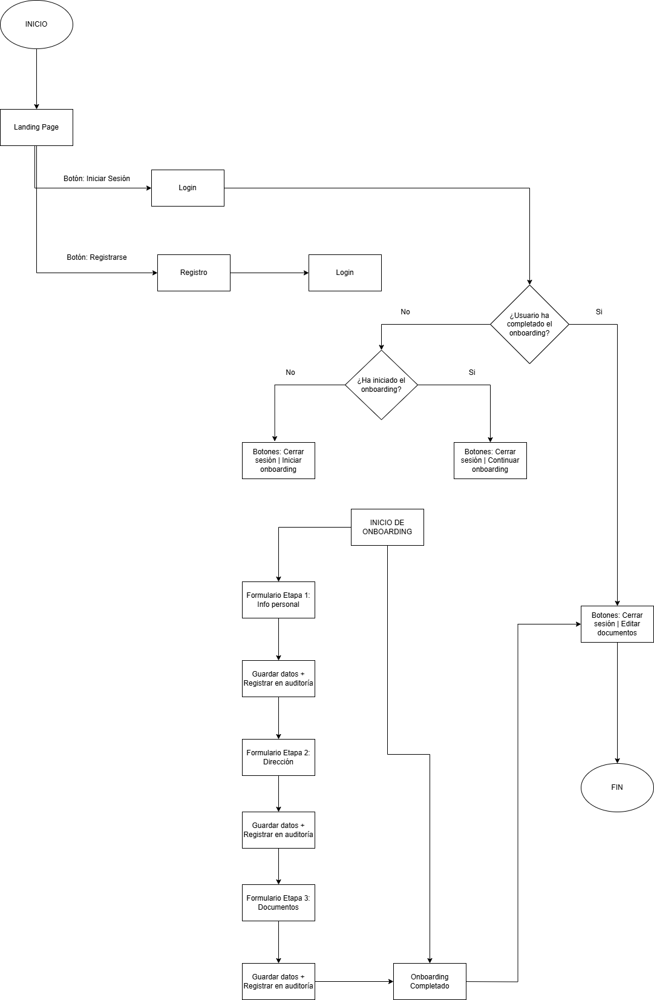
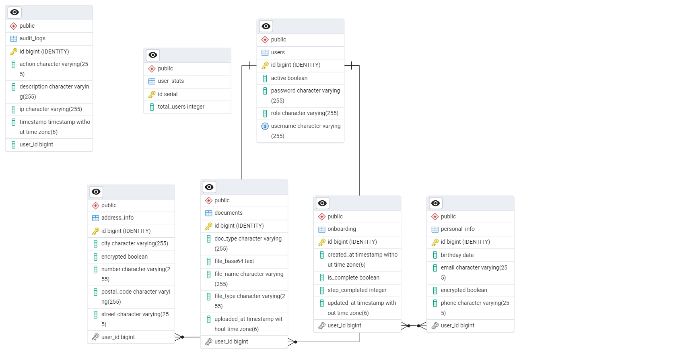

# Sistema de Onboarding Digital

## Tecnologías usadas

- Backend: Spring Boot (Java 17)
- Frontend: Angular 16 + Tailwind CSS
- Base de datos: PostgreSQL + PgAdmin
- Seguridad: JWT + AES-256
- Autenticación: JWT + Spring Security

## Descripción General

El sistema de Onboarding Digital permite registrar nuevos clientes mediante formularios divididos en etapas. Su objetivo es capturar información de manera eficiente, segura y trazable, abarcando desde la landing page inicial hasta la finalización del proceso de onboarding.

## Características clave

- Captura de datos personales, dirección y documentos.
- Almacenamiento seguro de información.
- Auditoría automática en cada etapa.
- Interfaz dinámica según el estado del usuario.
- Flujo condicional (inicio, continuación o edición del onboarding).
- Registro y inicio de sesión de usuarios mediante JWT y Spring Security.

## Procedimiento necesario para completar el Onboarding

1. El usuario accede a la **Landing Page**, donde puede **registrarse** o **iniciar sesión**.
2. Si el usuario se registra, posteriormente debe iniciar sesión.
3. Una vez autenticado, el sistema revisa el estado del proceso de onboarding del usuario:

   - Si **no ha iniciado**, se muestra un botón para comenzar el proceso.

   - Si el proceso está **incompleto**, se le ofrece continuar desde la última etapa completada.

   - Si el onboarding ya está **completo**, se le permite **editar documentos**.

4. El onboarding consta de **tres etapas**:

   - **Etapa 1**: Información personal.
   - **Etapa 2**: Dirección.
   - **Etapa 3**: Carga de documentos.

5. En cada etapa:

   - El usuario completa un formulario.
   - La información se **guarda en la base de datos**.
   - Se genera una **entrada en el sistema de auditoría**.
   - El usuario es redirigido a la siguiente etapa.

6. Al finalizar la tercera etapa, el proceso se marca como **completado**.

## Diagrama de flujo

<div style="width: 60%; margin: 12px;">
  
</div>

## Configuración y despliegue

El sistema ha sido desplegado de manera básica para propósitos de demostración y validación. Esto permite probar el flujo completo del sistema sin necesidad de configuraciones locales.

#### Detalles del despliegue:

- **Entorno de ejecución:** Render (contenedor Docker)
- **Base de datos:** PostgreSQL proporcionado por Render (instancia en el mismo entorno de despliegue)
- **URL de acceso back:** [https://onboarding-proyect.onrender.com](https://onboarding-proyect.onrender.com)
- **URL de acceso front:** [https://onboarding-app-jqzc.onrender.com/lading-page](https://onboarding-app-jqzc.onrender.com/lading-page)

#### Instrucciones para el despliegue local

Requisitos previos

- Docker y Docker Compose

### Configuración Inicial

1. Clona el repositorio

   ```bash
   git clone https://github.com/PepeBeto-code/redes-p1.git
   cd redes-p1
   ```

2. Configura las variables de entorno

   - Crea un archivo .env en ./onboarding-api/ basado en los archivos de ejemplo (./onboarding-api/.env.example).

   - Asegúrate de definir correctamente las credenciales de la base de datos y JWT.

### Ejecutar con Docker

Para ejecutar la aplicación completa con Docker:

```bash
docker-compose up --build -d
```

Esto hará lo siguiente:

- Construirá los contenedores de Backend, Frontend y Base de Datos
- La aplicación estará disponible en [http://localhost:4200](http://localhost:4200).
- La API estará disponible en [http://localhost:8080](http://localhost:8080).

Para detener la aplicación:

```bash
docker-compose down --rmi all -v --remove-orphans
```

## Modelo de Base de Datos

### Diagrama Entidad-Relación (DER)



### Script de creación de base de datos

Puedes encontrar el script SQL de creación en el archivo:  
[`docs/database/schema.sql`](docs/database/schema.sql)

Este script incluye:

- Creación de tablas: `usuarios`, `formularios`, `auditoria`, etc.
- Relaciones entre entidades (con claves foráneas).
- Tipos de datos, restricciones y valores por defecto.

## Lógica SQL avanzada: Stored Procedure y Trigger

### Carga automática de scripts SQL

Al iniciar la aplicación Spring Boot, se ejecuta automáticamente el archivo [`db/scripts.sql`](src/main/resources/db/scripts.sql), el cual contiene lógica avanzada en SQL:

- Creación de **stored procedures**.
- Definición de **triggers** y **funciones PL/pgSQL**.
- Inicialización de estructuras auxiliares para trazabilidad y auditoría.

Esto se realiza mediante la clase Java [`DatabaseInitializer`](src/main/java/com/example/onboarding_api/config/DatabaseInitializer.java), que lee y ejecuta el contenido del script al arrancar la aplicación.

### Contenido del script `scripts.sql`

- **Stored Procedure:** `update_onboarding_step(user_id, step)`

  - Actualiza el avance del proceso de onboarding para un usuario dado.
  - Marca el onboarding como completado si el paso actual es 3 o superior.

- **Tabla auxiliar:** `user_stats`

  - Guarda la cantidad de usuarios registrados.

- **Trigger:** `user_insert_trigger` sobre la tabla `users`
  - Ejecuta la función `increment_user_count()` cada vez que se inserta un nuevo usuario, incrementando el contador en `user_stats`.

<!--  -->

## Observaciones

- El sistema garantiza una experiencia intuitiva para el usuario.
- La trazabilidad se asegura registrando cada acción mediante un sistema de auditoría.
- El estado del usuario permite mostrar dinámicamente las opciones disponibles en la interfaz.

## Funcionalidad pendiente: Verificación de correo electrónico

En versiones futuras del sistema, se contempla la incorporación de un flujo de **verificación por correo electrónico** durante el registro de usuarios, con el siguiente procedimiento:

1. El usuario ingresa su **nombre completo**, **correo electrónico** y **contraseña** en el formulario de registro.
2. Se valida que el correo electrónico no exista previamente en la base de datos.
3. Se guarda la información del usuario en estado **inactivo** o **no verificado**.
4. Se envía un **correo de verificación** al usuario con un enlace único para activar su cuenta.
5. Al hacer clic en el enlace, el sistema verifica el token y activa la cuenta.

Esta funcionalidad mejorará la seguridad y autenticidad de los registros en el sistema.
